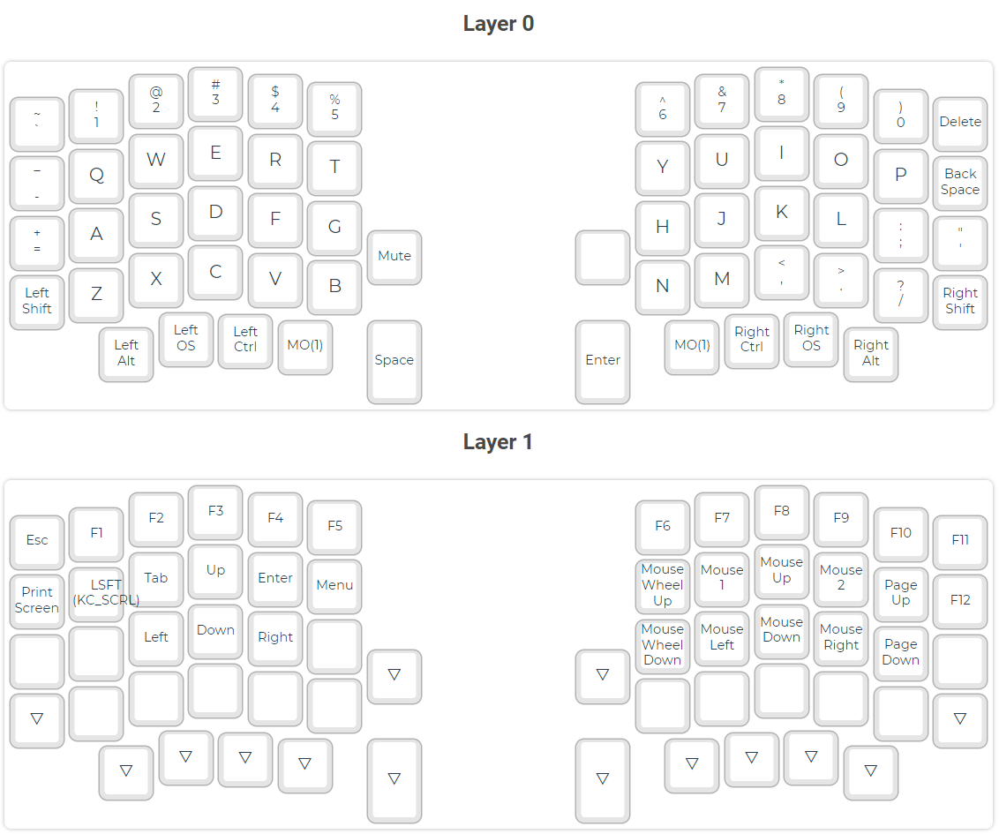

# Sofle Keyboard

Sofle is 6×4+5 keys column-staggered split keyboard with encoder support. Based on [Lily58](https://github.com/kata0510/Lily58), [Corne](https://github.com/foostan/crkbd) and [Helix](https://github.com/MakotoKurauchi/helix) keyboards.

**[For more information and documentation visit https://josefadamcik.github.io/SofleKeyboard/](https://josefadamcik.github.io/SofleKeyboard/)**

SofleKeyboard was created by [Josef Adamcik](https://josef-adamcik.cz/). This repository is a fork.

## Case

Case was created in SolidWorks 2020.

## Firmware

My keymap [keymap](/firmware/keymap.json) for [QMK Configurator](https://config.qmk.fm/#/sofle/rev1/LAYOUT).

## Layout

## Images of keyboard
